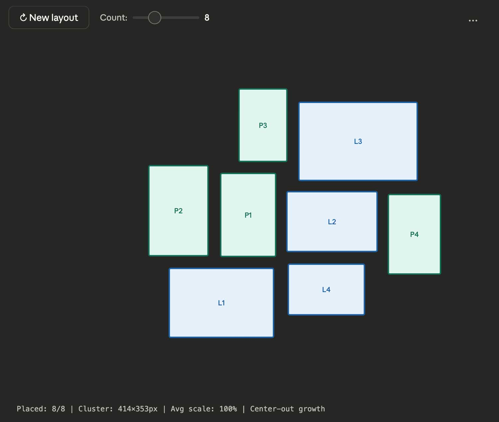
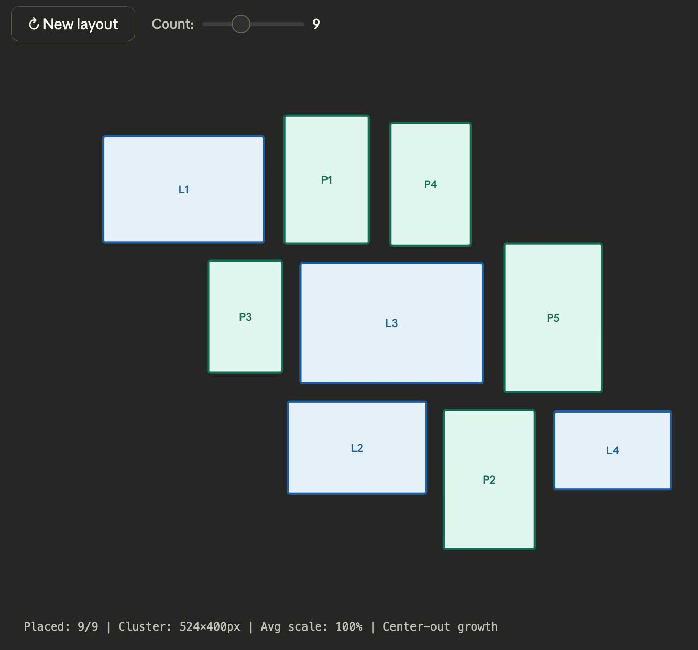
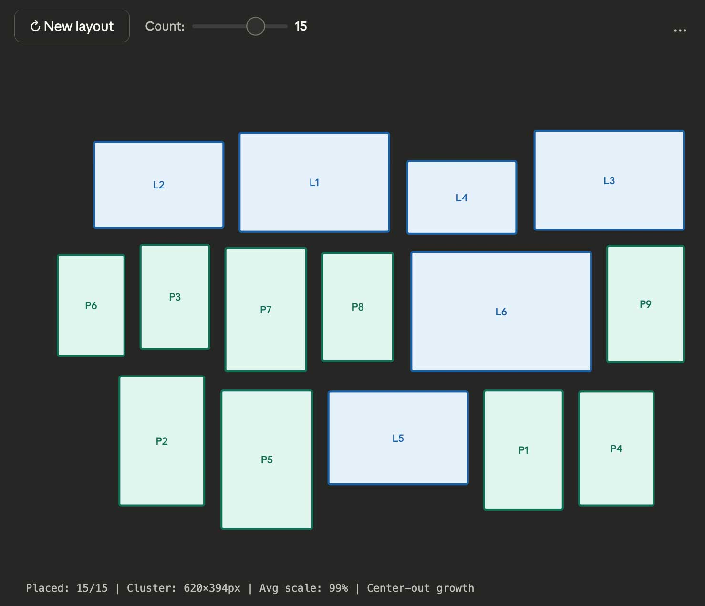
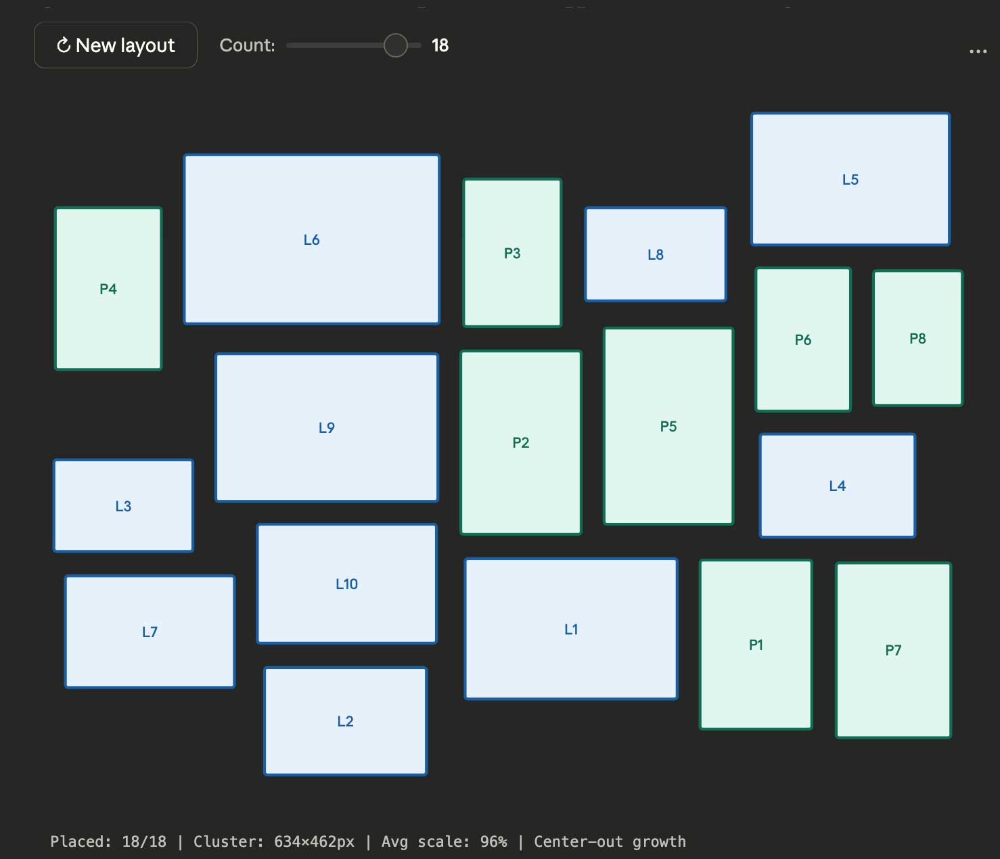

# Organic Gallery Layout Engine

## Project Overview

A React component package that algorithmically arranges images of varying aspect ratios (portrait and landscape) into tight, organic collages. The layout mimics the aesthetic of a curated gallery wall with consistent spacing and no visible grid structure.

**Package:** `@inkorange/pendu`
**Author:** Chris West
**Date:** March 2026
**Status:** In Development — targeting npm publish

---

## Design Goals

1. **Organic appearance** — No strict rows or columns; layouts should look hand-curated
2. **Consistent 16px spacing** — Uniform gaps between all frames
3. **Center-out density** — Core of the cluster is tightest; any looseness pushed to edges
4. **Adaptive scaling** — Frames can shrink (down to ~45%) to fill gaps while preserving aspect ratio
5. **Variable count support** — Works with 3–20+ images
6. **Deterministic output** — Same seed produces same layout (reproducible)

---

## Gallery Examples

The layout engine uses a center-out growth algorithm with adaptive scaling and compaction. Below are examples at different frame counts:

### 8 Frames



*8 frames — 414×353px cluster, 100% average scale*

---

### 9 Frames



*9 frames — 524×400px cluster, 100% average scale*

---

### 15 Frames



*15 frames — 620×394px cluster, 99% average scale*

---

### 18 Frames



*18 frames — 634×462px cluster, 96% average scale*

---

## Core Algorithm

### Placement Scoring Function

```javascript
function scorePosition(rect, placed) {
  const {contacts, contactLength} = getEdgeContact(rect, placed);
  const dist = distToCenter(rect);

  return contacts * 150        // Reward multi-neighbor contact
       + contactLength * 3     // Reward longer edge overlap
       - dist * 0.8            // Strong pull toward center
       + scale * 10            // Prefer larger when possible
       + random * 8;           // Organic variety
}
```

### Key Functions

#### 1. Edge Contact Detection
```javascript
function getEdgeContact(rect, placed) {
  let contacts = 0, contactLength = 0;

  for (const p of placed) {
    // Check all 4 edges for GAP-distance adjacency
    // Measure overlap length along shared edge
  }

  return {contacts, contactLength};
}
```

#### 2. Candidate Generation
```javascript
function generateCandidates(placed, w, h) {
  const candidates = [];

  for (const p of placed) {
    // Snap positions along all 4 edges of each placed frame
    // Multiple y-offsets for vertical edges
    // Multiple x-offsets for horizontal edges
  }

  return candidates;
}
```

#### 3. Center Compaction
```javascript
function compactToCenter(placed) {
  for (let iter = 0; iter < 15; iter++) {
    // Sort frames by distance (compact inner first)
    for (const frame of framesByDistance) {
      // Calculate vector toward true center
      // Move if new position is valid (no overlap, in bounds)
    }
  }
}
```

#### 4. Interior Gap Filling
```javascript
function fillInteriorGaps(placed) {
  for (let pass = 0; pass < 5; pass++) {
    for (const frame of placed) {
      // Try micro-shifts in 8 directions
      // Accept shift if it reduces center distance
      // or increases edge contact
    }
  }
}
```

---

## Configuration Parameters

| Parameter | Default | Description |
|-----------|---------|-------------|
| `GAP` | 16px | Uniform spacing between all frames |
| `MIN_SCALE` | 0.45 | Minimum frame scale (45% of base size) |
| `CANVAS_W` | 680px | Container width |
| `CANVAS_H` | 500px | Container height |
| `PAD` | 10px | Padding from canvas edges |

---

## Component API

### Basic Usage

```tsx
'use client'; // required for Next.js App Router / RSC environments
import { Pendu } from '@inkorange/pendu';

<Pendu gap={16}>
  <Pendu.Image src="/photo1.jpg" width={800} height={600} alt="Sunset" />
  <Pendu.Image src="/photo2.jpg" width={600} height={900} alt="Portrait" />
  <Pendu.Image src="/photo3.jpg" width={1200} height={800} alt="Landscape" />
</Pendu>
```

The consumer simply nests `<Pendu.Image>` children inside a `<Pendu>` container. The parent component reads `width` and `height` from each child's props to compute the organic layout, then positions each frame automatically. No data arrays, no hooks, no render functions — just components.

### `<Pendu>` Props

```typescript
interface PenduProps {
  gap?: number;                 // Spacing between frames (default: 16)
  minScale?: number;            // Minimum scale factor (default: 0.45)
  padding?: number;             // Padding from container edges (default: 10)
  seed?: number;                // Optional — randomized internally if omitted
  animate?: boolean;            // Enable layout transition animations (default: true)
  animationDuration?: number;   // Transition duration in ms (default: 300)
  className?: string;           // CSS class for the container
  style?: React.CSSProperties;  // Inline styles for the container
  children: React.ReactNode;    // <Pendu.Image> elements
}
```

### `<Pendu.Image>` Props

```typescript
interface PenduImageProps {
  src: string;                  // Image source URL
  width: number;                // Natural image width (for aspect ratio calculation)
  height: number;               // Natural image height (for aspect ratio calculation)
  alt?: string;                 // Accessibility text
  className?: string;           // CSS class for the frame
  style?: React.CSSProperties;  // Additional inline styles (merged with computed position)
  onClick?: (e: React.MouseEvent) => void;
}
```

### Styling

The component uses **CSS Modules with SCSS** internally for scoped styles, and exposes **CSS custom properties (variables)** on the root element for consumer customization. This means consumers can theme the gallery without passing a className or writing selectors — just set the variables:

#### CSS Variables (zero-config theming)

```tsx
// Option 1: Override variables via inline style
<Pendu
  gap={16}
  style={{
    '--pendu-bg': '#1a1a1a',
    '--pendu-frame-radius': '8px',
    '--pendu-frame-shadow': '0 2px 8px rgba(0, 0, 0, 0.3)',
  } as React.CSSProperties}
>
  <Pendu.Image src="/photo1.jpg" width={800} height={600} />
</Pendu>

// Option 2: Override variables via CSS (no className needed — scope to the component)
```

```css
/* Override anywhere in the cascade — the component picks them up */
.pendu {
  --pendu-bg: #1a1a1a;
  --pendu-frame-radius: 8px;
  --pendu-frame-shadow: 0 2px 8px rgba(0, 0, 0, 0.3);
  --pendu-transition-duration: 300ms;
  --pendu-frame-border: none;
  --pendu-frame-overflow: hidden;
}
```

#### Available CSS Variables

| Variable | Default | Description |
|----------|---------|-------------|
| `--pendu-bg` | `transparent` | Container background color |
| `--pendu-gap` | `16px` | Spacing between frames (mirrors `gap` prop) |
| `--pendu-padding` | `10px` | Container inner padding |
| `--pendu-frame-radius` | `0` | Border radius on frame wrappers |
| `--pendu-frame-shadow` | `none` | Box shadow on frame wrappers |
| `--pendu-frame-border` | `none` | Border on frame wrappers |
| `--pendu-frame-overflow` | `visible` | Overflow behavior on frame wrappers |
| `--pendu-transition-duration` | `300ms` | Animation duration for layout transitions |
| `--pendu-transition-easing` | `ease-out` | Animation easing curve |
| `--pendu-skeleton-bg` | `#e0e0e0` | Skeleton placeholder background color |

#### className Targeting (advanced)

For more granular control, pass a `className` to target specific DOM elements:

```tsx
<Pendu gap={16} className="my-gallery">
  <Pendu.Image src="/photo1.jpg" width={800} height={600} />
  <Pendu.Image src="/photo2.jpg" width={600} height={900} className="featured" />
</Pendu>
```

```css
.my-gallery {
  background: #1a1a1a;
  border-radius: 12px;
}

.my-gallery .pendu-frame img {
  object-fit: cover;
  transition: transform 0.2s ease;
}

.my-gallery .pendu-frame img:hover {
  transform: scale(1.05);
}

/* Per-image styling */
.my-gallery .featured {
  border: 2px solid gold;
}
```

#### DOM Structure

```html
<div class="pendu my-gallery"            <!-- root (CSS Module class + consumer className) -->
     style="--pendu-bg: ...; ...">       <!-- CSS vars set here -->
  <div class="pendu-frame">              <!-- positioned frame wrapper -->
               <!-- the image -->
  </div>
  ...
</div>
```

---

### Dynamic Images (Add / Remove)

The consumer manages images with standard React state. Add, remove, or reorder — the layout updates smoothly:

```tsx
const [images, setImages] = useState([
  { id: '1', src: '/photo1.jpg', width: 800, height: 600, alt: 'Sunset' },
  { id: '2', src: '/photo2.jpg', width: 600, height: 900, alt: 'Portrait' },
]);

<Pendu gap={16}>
  {images.map(img => (
    <Pendu.Image
      key={img.id}
      src={img.src}
      width={img.width}
      height={img.height}
      alt={img.alt}
    />
  ))}
</Pendu>

// Add
setImages(prev => [...prev, newImage]);

// Remove
setImages(prev => prev.filter(img => img.id !== removeId));
```

### Layout Stability & Animation

When images are added or removed, the gallery does **not** recompute the entire layout from scratch. Instead, it uses **incremental layout updates** to preserve the user's spatial context:

**On remove:**
- The removed image fades/scales out
- Neighboring frames shift inward to close the gap via a local compaction pass
- Frames far from the removed image stay put

**On add:**
- The layout engine scores candidate positions relative to existing placed frames (the same scoring algorithm used during initial layout)
- The new image scales/fades in at its computed position
- Surrounding frames make minimal adjustments if needed

**Animation:** All position changes use the **FLIP technique** (First, Last, Invert, Play) — built into the component with zero external dependencies. Frames animate via GPU-accelerated CSS `transform: translate()` from their old positions to their new positions. The result feels like images are sliding into place rather than jumping.

```typescript
// Consumer can optionally configure animation behavior
<Pendu gap={16} animate={true} animationDuration={300}>
  ...
</Pendu>
```

---

## Package Details

- **Peer dependency:** React 18+
- **Language:** TypeScript
- **No external dependencies** beyond React
- **Rendering:** Absolute-positioned div layout with `` tags
- **Container sizing:** Fills parent width via `ResizeObserver`; height auto-computed from layout bounds
- **SSR / RSC:** `'use client'` directive included — works in Next.js App Router out of the box
- **Bundle size:** Target < 20KB gzipped
- **Accessibility:** Alt text passthrough on all images; respects `prefers-reduced-motion`
- **Image loading:** Skeleton placeholders while images load; fade in on ready
- **Performance:** Layout computation memoized via `useMemo`; frame components wrapped in `React.memo`; O(n² × candidates) algorithm acceptable for n < 50

---

## Implementation Notes

### Performance Strategy
- **Incremental layout** — add/remove operations update the existing layout, not recompute from scratch
- `React.memo` on `Pendu.Image` — unchanged frames skip re-rendering
- Stable `key` props on each `<Pendu.Image>` for efficient React reconciliation
- FLIP animations use only `transform` (GPU-accelerated, no layout thrashing)

### Layout Update Strategy

| Operation | Strategy | What moves |
|-----------|----------|------------|
| Initial render | Full center-out placement | All frames placed one at a time |
| Image added | Incremental — score best position among existing frames | New frame enters; neighbors may shift slightly |
| Image removed | Local compaction — close the gap, pull neighbors inward | Nearby frames shift; distant frames stay put |
| Seed changed | Full recompute | All frames re-layout with animation |
| Container resize | Responsive reflow | All frames re-layout with animation |

### Future Optimizations
- Spatial indexing (quadtree) for faster overlap checks
- Cached edge positions
- Web Worker for non-blocking computation on large galleries

---

## File Structure

```
pendu/
├── PROJECT.md              # This file
├── IMPLEMENTATION.md       # Development roadmap
├── resources/
│   ├── screen-*.jpg        # Algorithm screenshots
│   └── demo/               # Demo/test images
├── src/
│   ├── index.ts              # Barrel export (package entry point)
│   ├── Pendu.tsx             # <Pendu> container component
│   ├── PenduImage.tsx        # <Pendu.Image> child component
│   ├── layout.ts             # Core algorithm
│   ├── types.ts              # TypeScript interfaces
│   ├── utils.ts              # Helper functions
│   └── styles/
│       ├── _variables.scss       # CSS variable defaults + SCSS mixins
│       ├── Pendu.module.scss     # Container styles (CSS Module)
│       └── PenduImage.module.scss # Frame styles (CSS Module)
├── demo/
│   └── index.html          # Interactive demo
└── README.md               # Quick start guide
```

---

## Next Steps

1. [ ] Extract algorithm into standalone TypeScript module (full + incremental layout modes)
2. [ ] Add unit tests for edge cases
3. [ ] Build `<Pendu>` compound component with built-in FLIP animation
4. [ ] Publish to npm as `@inkorange/pendu`
5. [ ] Add drag-to-reorder functionality
6. [ ] Implement responsive reflow on container resize

See [IMPLEMENTATION.md](./IMPLEMENTATION.md) for the detailed development roadmap.

---

## License

MIT
