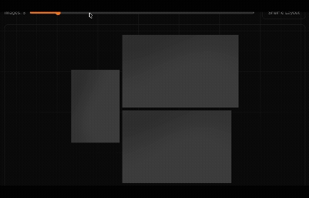

<p align="center">
  <a href="https://pendu.chriswest.tech">
    
  </a>
</p>

<p align="center">
  <strong>Organic gallery layouts for React.</strong><br/>
  Arrange images and custom content into beautiful, natural collages — no grid, no masonry, just art.
</p>

<p align="center">
  <a href="https://pendu.chriswest.tech">Website</a> &middot;
  <a href="https://pendu.chriswest.tech/examples">Examples</a> &middot;
  <a href="https://pendu.chriswest.tech/docs">Docs</a> &middot;
  <a href="https://pendu.chriswest.tech/playground">Playground</a>
</p>

<p align="center">
  <a href="https://www.npmjs.com/package/@inkorange/pendu"></a>
  
  
  
  <a href="https://github.com/inkorange/pendu/blob/main/LICENSE"></a>
</p>

<p align="center">
  
</p>

## Install

```bash
npm install @inkorange/pendu
```

## Quick Start

```tsx
import { Pendu } from '@inkorange/pendu';

function Gallery() {
  return (
    <Pendu gap={12} seed={42}>
      <Pendu.Image src="/sunset.jpg" width={1200} height={800} alt="Sunset" />
      <Pendu.Image src="/portrait.jpg" width={800} height={1200} alt="Portrait" />
      <Pendu.Image src="/cityscape.jpg" width={1600} height={1000} alt="City" />
    </Pendu>
  );
}
```

## Features

- **Organic layouts** — No rows, columns, or grids. Images arrange into natural, gallery-wall collages that fill your container.
- **Animated transitions** — FLIP animations smoothly move content when the gallery changes. Add, remove, or reorder — every transition feels intentional.
- **Container aware** — Automatically adapts to any container size — fixed, percentage, or viewport units. Content scales and reflows to fill the space.
- **Tiny footprint** — 5.4 KB gzipped, zero runtime dependencies. Only 6 files installed, nothing beyond React as a peer dependency.
- **CSS variable theming** — Customize gap, radius, and background via `--pendu-*` custom properties. No prop drilling needed.
- **Deterministic seeds** — Same seed + same inputs = identical layout. Reproducible across renders, servers, and sessions.
- **TypeScript** — Full type safety with exported interfaces.
- **SSR ready** — Works with Next.js App Router and React Server Components.

## Dynamic Images

Pendu reacts to children changes automatically. Just update your array:

```tsx
import { useState } from 'react';
import { Pendu } from '@inkorange/pendu';

function PhotoManager({ photos }) {
  const [visible, setVisible] = useState(photos);

  const remove = (id: string) => {
    setVisible(prev => prev.filter(p => p.id !== id));
  };

  return (
    <Pendu gap={12}>
      {visible.map(photo => (
        <Pendu.Image
          key={photo.id}
          src={photo.src}
          width={photo.width}
          height={photo.height}
          alt={photo.alt}
        />
      ))}
    </Pendu>
  );
}
```

## Custom Content with Pendu.Item

Mix images with any React component. Use `Pendu.Item` for videos, cards, or custom content:

```tsx
<Pendu gap={12}>
  <Pendu.Image src="/photo.jpg" width={1200} height={800} alt="Photo" />

  <Pendu.Item width={400} height={300}>
    <video src="/clip.mp4" autoPlay muted loop />
  </Pendu.Item>

  <Pendu.Item width={400} height={400}>
    <div className="promo-card">
      <h3>New Collection</h3>
      <p>Explore the latest additions</p>
    </div>
  </Pendu.Item>
</Pendu>
```

## CSS Variable Theming

Style without props — set CSS custom properties on the gallery or any ancestor:

```css
.my-gallery {
  --pendu-gap: 16px;
  --pendu-frame-radius: 8px;
  --pendu-bg: #1a1a1a;
  --pendu-transition-duration: 500ms;
  --pendu-transition-easing: cubic-bezier(0.25, 0.1, 0.25, 1);
  --pendu-skeleton-bg: #333;
}
```

## API Reference

### `<Pendu>` Props

| Prop | Type | Default | Description |
|------|------|---------|-------------|
| `gap` | `number` | `16` | Space between frames in pixels |
| `seed` | `number` | random | Random seed for deterministic layouts |
| `padding` | `number` | `10` | Inner padding of the gallery |
| `animate` | `boolean` | `true` | Enable FLIP animations |
| `animationDuration` | `number` | `300` | Animation duration in ms |
| `className` | `string` | — | CSS class on the root element |

### `<Pendu.Image>` Props

| Prop | Type | Default | Description |
|------|------|---------|-------------|
| `src` | `string` | required | Image source URL |
| `width` | `number` | required | Original width (for aspect ratio) |
| `height` | `number` | required | Original height (for aspect ratio) |
| `alt` | `string` | `""` | Alt text for accessibility |

### `<Pendu.Item>` Props

| Prop | Type | Default | Description |
|------|------|---------|-------------|
| `width` | `number` | required | Desired width (for aspect ratio) |
| `height` | `number` | required | Desired height (for aspect ratio) |
| `children` | `ReactNode` | required | Content to render inside the frame |

## Container Behavior

- **Dynamic height (default):** Gallery grows vertically to fit all content. Container only needs a width.
- **Fixed height:** When the parent has a fixed height (px, vh, %), the gallery scales to fit both dimensions.
- **Responsive:** Pendu observes container resizes and re-layouts automatically.

## License

MIT
